```mermaid
erDiagram

    %% ==================== CORE ====================

    TENANTS {
        int     id          PK
        text    name
        text    vertical
        json    settings
        timestamp createdAt
    }

    USERS {
        int     id          PK
        int     tenantId    FK
        text    name
        text    email
        text    passwordHash
        text    role
        bool    isActive
        timestamp createdAt
        timestamp updatedAt
    }

    %% ==================== MASTER DATA ====================

    SUPPLIERS {
        int     id          PK
        int     tenantId    FK
        text    code
        text    name
        text    taxId
        text    address
        text    phone
        text    email
        text    contactPerson
        bool    isActive
        timestamp deletedAt
    }

    CUSTOMERS {
        int     id          PK
        int     tenantId    FK
        text    code
        text    name
        text    taxId
        text    address
        text    phone
        text    email
        text    contactPerson
        bool    isActive
        timestamp deletedAt
    }

    TRADER_PRODUCTS {
        int     id          PK
        int     tenantId    FK
        text    code
        text    name
        text    description
        text    unit
        text    category
        bool    isActive
        timestamp deletedAt
    }

    PRODUCT_PRICES {
        int     id          PK
        int     tenantId    FK
        int     productId   FK
        int     supplierId  FK
        real    costPrice
        real    sellPrice
        text    effectiveDate
        bool    isCurrent
        timestamp createdAt
    }

    PRODUCT_INVENTORY {
        int     id          PK
        int     tenantId    FK
        int     productId   FK
        real    qtyOnHand
        real    qtyReserved
        text    location
        timestamp updatedAt
    }

    %% ==================== SALES (QUOTATIONS) ====================

    QUOTATIONS {
        int     id              PK
        int     tenantId        FK
        text    quoteNumber
        text    status
        int     customerId      FK
        int     supplierId      FK
        text    customerName
        text    customerCompany
        text    projectName
        text    sessionId
        real    subtotal
        real    vatRate
        real    vatAmount
        real    total
        text    currency
        text    validUntil
        timestamp createdAt
        timestamp updatedAt
    }

    QUOTATION_ITEMS {
        int     id          PK
        int     quotationId FK
        int     productId   FK
        text    productName
        real    qty
        text    unit
        real    unitPrice
        real    discountPct
        real    lineTotal
        int     sortOrder
    }

    QUOTATION_HISTORY {
        int     id          PK
        int     quotationId FK
        text    action
        text    changedBy
        json    snapshot
        timestamp createdAt
    }

    QUOTE_LOSS_REASONS {
        int     id          PK
        int     tenantId    FK
        int     quotationId FK
        text    reasonType
        text    competitorName
        text    notes
        timestamp lostAt
    }

    %% ==================== PROCUREMENT (PURCHASE ORDERS) ====================

    PURCHASE_ORDERS {
        int     id                  PK
        int     tenantId            FK
        text    poNumber
        int     supplierId          FK
        int     sourceQuotationId   FK
        text    status
        text    currency
        real    exchangeRate
        text    paymentTerm
        text    deliveryTerm
        text    shippingMethod
        text    expectedDate
        real    subtotal
        real    subtotalThb
        real    totalLandedCost
        text    issuedDate
        text    createdBy
        text    approvedBy
        timestamp deletedAt
    }

    PURCHASE_ORDER_ITEMS {
        int     id                  PK
        int     tenantId            FK
        int     purchaseOrderId     FK
        text    itemType
        text    name
        text    sku
        text    unit
        real    quantity
        real    exWorkPrice
        real    freightCost
        real    cifPrice
        real    taxRate
        real    clearingCost
        real    landedCostPerUnit
        real    lineTotal
        real    lineTotalThb
        real    quantityReceived
        json    itemData
    }

    PO_RECEIPTS {
        int     id              PK
        int     tenantId        FK
        int     purchaseOrderId FK
        text    receiptNumber
        text    receivedDate
        text    receivedBy
        text    note
        timestamp createdAt
    }

    PO_RECEIPT_ITEMS {
        int     id              PK
        int     tenantId        FK
        int     receiptId       FK
        int     poItemId        FK
        real    quantityReceived
        text    lotNumber
        text    lotExpirationDate
        text    location
        text    note
    }

    PO_HISTORY {
        int     id              PK
        int     tenantId        FK
        int     purchaseOrderId FK
        text    action
        text    oldStatus
        text    newStatus
        text    changedBy
        text    note
        timestamp createdAt
    }

    PO_APPROVALS {
        int     id              PK
        int     tenantId        FK
        int     purchaseOrderId FK
        text    approverName
        text    decision
        real    amountThb
        text    note
        timestamp decidedAt
    }

    %% ==================== COMMUNICATION & FILES ====================

    EMAILS {
        text    id          PK
        int     tenantId    FK
        text    sessionId
        text    provider
        text    fromEmail
        text    fromName
        text    subject
        text    bodyText
        timestamp receivedAt
        timestamp fetchedAt
    }

    DRAFTS {
        text    id          PK
        int     tenantId    FK
        text    emailId     FK
        text    sessionId
        text    draftBody
        text    status
        timestamp sentAt
        timestamp createdAt
        timestamp updatedAt
    }

    MAIL_TOKENS {
        text    id          PK
        int     tenantId    FK
        text    sessionId
        text    provider
        text    accessToken
        text    refreshToken
        int     expiresAt
        text    email
        timestamp createdAt
    }

    FILE_CHUNKS {
        text    id          PK
        int     tenantId    FK
        text    sessionId
        text    fileName
        text    fileType
        text    sheetName
        int     rowStart
        int     rowEnd
        int     pageNumber
        int     chunkIndex
        text    content
        text    preview
        text    embedding
        timestamp createdAt
    }

    %% ==================== ANALYTICS, REPORTING & IMPORT ====================

    IMPORT_TEMPLATES {
        int     id          PK
        int     tenantId    FK
        text    name
        text    targetTable
        json    columnMapping
        timestamp createdAt
        timestamp updatedAt
    }

    IMPORT_LOGS {
        text    id          PK
        int     tenantId    FK
        int     templateId  FK
        text    fileName
        int     totalRows
        int     successRows
        int     failedRows
        json    errors
        timestamp createdAt
    }

    SALES_TARGETS {
        int     id          PK
        int     tenantId    FK
        int     userId      FK
        text    periodType
        text    periodKey
        text    metricType
        real    targetValue
        timestamp createdAt
        timestamp updatedAt
    }

    ACTIVITY_LOG {
        int     id          PK
        int     tenantId    FK
        int     userId      FK
        text    activityType
        text    entityType
        int     entityId
        real    value
        json    metadata
        timestamp occurredAt
    }

    SAVED_REPORTS {
        int     id          PK
        int     tenantId    FK
        int     userId      FK
        text    name
        text    reportType
        json    filters
        timestamp lastRunAt
        timestamp createdAt
    }

    REPORT_CACHE {
        int     id          PK
        int     tenantId    FK
        text    cacheKey
        json    data
        timestamp computedAt
        timestamp expiresAt
    }

    NOTIFICATIONS {
        int     id          PK
        int     tenantId    FK
        int     userId      FK
        text    type
        text    severity
        text    title
        text    message
        text    entityType
        int     entityId
        text    link
        bool    isRead
        timestamp readAt
        timestamp createdAt
    }

    %% ==================== RELATIONSHIPS ====================

    %% Core
    TENANTS         ||--o{ USERS               : "has"
    TENANTS         ||--o{ SUPPLIERS           : "has"
    TENANTS         ||--o{ CUSTOMERS           : "has"
    TENANTS         ||--o{ TRADER_PRODUCTS     : "has"
    TENANTS         ||--o{ QUOTATIONS          : "has"
    TENANTS         ||--o{ PURCHASE_ORDERS     : "has"

    %% Products
    TRADER_PRODUCTS ||--o{ PRODUCT_PRICES      : "priced by"
    SUPPLIERS       ||--o{ PRODUCT_PRICES      : "priced for"
    TRADER_PRODUCTS ||--o| PRODUCT_INVENTORY   : "tracked in"

    %% Quotations
    CUSTOMERS       ||--o{ QUOTATIONS          : "receives"
    SUPPLIERS       ||--o{ QUOTATIONS          : "quoted from"
    QUOTATIONS      ||--|{ QUOTATION_ITEMS     : "contains"
    QUOTATIONS      ||--o{ QUOTATION_HISTORY   : "has history"
    QUOTATIONS      ||--o{ QUOTE_LOSS_REASONS  : "lost via"
    TRADER_PRODUCTS ||--o{ QUOTATION_ITEMS     : "used in"

    %% Purchase Orders
    SUPPLIERS           ||--o{ PURCHASE_ORDERS         : "supplies"
    QUOTATIONS          ||--o{ PURCHASE_ORDERS         : "sources"
    PURCHASE_ORDERS     ||--|{ PURCHASE_ORDER_ITEMS    : "contains"
    PURCHASE_ORDERS     ||--o{ PO_RECEIPTS             : "received via"
    PURCHASE_ORDERS     ||--o{ PO_HISTORY              : "has history"
    PURCHASE_ORDERS     ||--o{ PO_APPROVALS            : "approved via"
    PO_RECEIPTS         ||--|{ PO_RECEIPT_ITEMS        : "contains"
    PURCHASE_ORDER_ITEMS||--o{ PO_RECEIPT_ITEMS        : "received in"

    %% Communication
    EMAILS          ||--o{ DRAFTS              : "has draft"

    %% Import
    IMPORT_TEMPLATES||--o{ IMPORT_LOGS         : "used in"

    %% Analytics
    USERS           ||--o{ SALES_TARGETS       : "has"
    USERS           ||--o{ ACTIVITY_LOG        : "records"
    USERS           ||--o{ SAVED_REPORTS       : "saves"
    USERS           ||--o{ NOTIFICATIONS       : "receives"
```

# Flowmerce ER Diagram

> **วิธีเปิดใน draw.io:**
> 1. เปิด [app.diagrams.net](https://app.diagrams.net)
> 2. ไปที่ **Extras → Edit Diagram**
> 3. วาง Mermaid code ด้านล่างลงไป แล้วกด **OK**

---

---

## Entity Summary

| Domain | Tables | หมายเหตุ |
|---|---|---|
| **Core** | `tenants`, `users` | Multi-tenant, Role-based auth |
| **Master Data** | `suppliers`, `customers`, `trader_products` | Soft delete (deletedAt) |
| **Products** | `product_prices`, `product_inventory` | Price history + Stock tracking |
| **Sales** | `quotations`, `quotation_items`, `quotation_history`, `quote_loss_reasons` | Sales pipeline |
| **Procurement** | `purchase_orders`, `purchase_order_items`, `po_receipts`, `po_receipt_items`, `po_history`, `po_approvals` | Full PO lifecycle, Cascade delete |
| **Communication** | `emails`, `drafts`, `mail_tokens`, `file_chunks` | Email + RAG integration |
| **Analytics** | `sales_targets`, `activity_log`, `saved_reports`, `report_cache`, `notifications` | Reporting + Alerts |
| **Import** | `import_templates`, `import_logs` | Data import config |

**Total: 28 tables**
